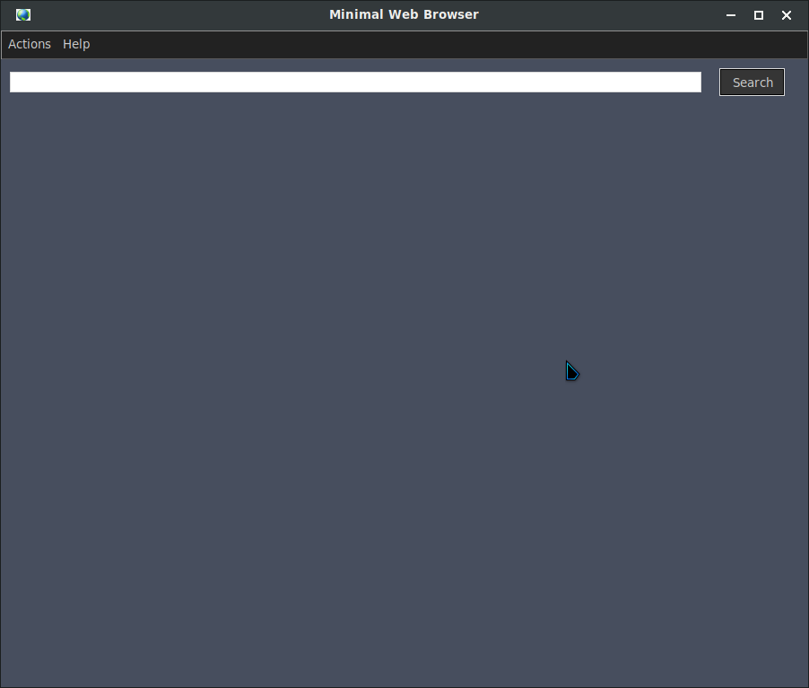

# Minimal Web Browser.

**A minimal web browser made with python3 and tkhtmlview like template rendering.**

## Installation.

```bash
$ git clone https://github.com/EduardYan/minimal-web-browser.git
$ cd minimal-web-browser
```

### Dependencies.
**Install the dependencies using pip package manager. Or other package manager for python3 as weel.**

```bash
$ pip3 install requirements.txt
```

**But you can install the dependencies with the python script 'install.py' running:**

```bash
$ python3 install.py
```

## Use.

```bash
$ python3 app.py
```

**Or if your system is Linux or Mac execute like a script:**

```bash
$ ./app.py
```

## Screenshot.


## Help and Support.

**Contact to programmer using this email eduarygp@gmail.com**
